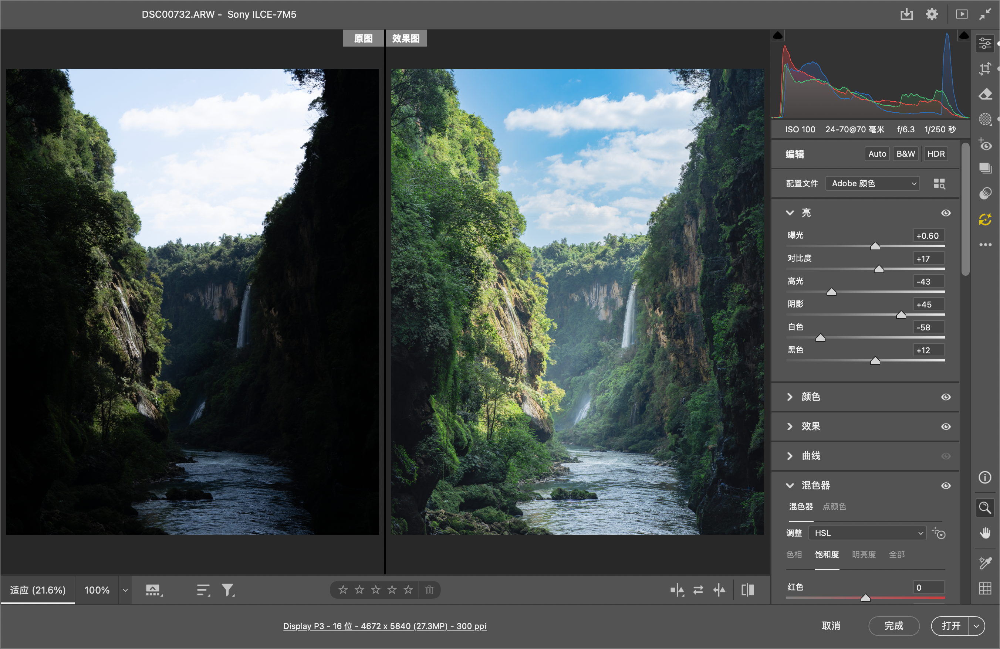

# ps-auto-color · Photoshop 自动调色技能

让具备本地电脑操作能力的 AI 助手，在 Photoshop 的 Camera Raw 中按照片的题材、光线与表达完成调色、复审和保存。

它共用一套观察与核验方法，风光、人像、街头、建筑、花卉动物、夜景可以走不同路线。同一题材也有多种候选，不用一组参数处理所有照片。

[GitHub](https://github.com/zihaoyan1023-ai/ps-auto-color) · [Gitee](https://gitee.com/aholic666/ps-auto-color) · [技能入口](skills/ps-auto-color/SKILL.md)

## 实操对比



维护者提供的 Camera Raw 界面对比截图，左侧为界面标记的“原图”，右侧为该次调整效果。保留截图原貌；这是一例实际调整状态，不能从截图推导所有 RAW 的通用参数，也不代表六类题材均已验证。示例图片的许可范围见 [媒体说明](assets/README.md)。

## 能做什么

- 先理解当前显影、已有裁切与蒙版，建立可恢复的工作起点，再续修。
- 按题材、天气、光线和用户偏好选择路线；包含六类题材、十九条候选路线。
- 对支持的 RAW 默认启用并检查 AI 降噪；强度随纹理与画面调整。
- 通过白平衡、明暗、曲线、HSL／Point Color、色彩分级和局部蒙版解决实际问题。
- 每组调整后看图，完整复审并进行针对性的第二遍检查。
- 在 Camera Raw 中导出独立成片，分别核验文件、保存的参数和视觉结果。

## 使用条件与边界

这是 **AI 助手的技能说明与只读核验脚本**，不是 Photoshop 插件或独立的一键修图程序。安装文本不会自动赋予助手控制电脑的能力。

需要已安装且合法可用的 Photoshop／Camera Raw，以及能观察图片、读取界面并可靠操作本地应用的助手工具。仅有浏览器自动化或普通聊天能力无法完成本地实操。实际调色、降噪、裁切与蒙版在 Camera Raw 内完成，不通过改写 XMP、生成图片或云端修图替代。

已实践的环境是 **macOS、Photoshop 2024、Camera Raw 18.6 的原生桌面流程**。这不是最低版本承诺；Windows、其他语言界面、其他助手及其他 CR 版本尚未完成系统适配验证。AI 降噪、Glow、Point Color 和 AI 编辑栈取决于具体版本、文件及硬件能力。默认降噪是工作流程偏好，并不保证每张照片都获益。

普通 SDR JPEG 的初始默认值为质量 12、sRGB、8 位、不缩放、不额外输出锐化；用途和用户要求优先。没有固定裁切比例。文件核验通过不等于用户已经满意。

## 安装与调用

从任意一个仓库下载代码或克隆，两个地址提供同一项目：

```sh
git clone https://github.com/zihaoyan1023-ai/ps-auto-color.git
```

国内可改用：

```sh
git clone https://gitee.com/aholic666/ps-auto-color.git
```

将仓库中的 `skills/ps-auto-color` 文件夹复制到当前 Codex 支持的技能目录。按 [OpenAI 官方技能文档](https://learn.chatgpt.com/docs/build-skills)，个人技能可放在 `~/.agents/skills/ps-auto-color`，项目技能可放在该项目的 `.agents/skills/ps-auto-color`。同名技能已存在时先保留旧版，再进行有意识的替换；不要重复安装到多个扫描位置。也可让 `$skill-installer` 从本仓库的 `skills/ps-auto-color` 路径安装。若未被发现，重启 Codex 并检查当前版本支持的目录。

调用示例（替换为自己的实际路径）：

```text
请用 $ps-auto-color 处理 /path/to/photo.ARW。
根据这张照片的题材和光线选路，保持自然的空间层次，
在本地 Camera Raw 中调色复审，保存到 /path/to/output。
```

```text
请用 $ps-auto-color 继续当前照片的调色，保留已有调整，
减弱谷内过重的灰雾，检查水流细节，再保存独立版本。
```

```text
请用 $ps-auto-color 只分析这组参考图的颜色与明暗关系，暂不操作照片。
```

## 文件核验脚本

Python 3 用于只读的哈希、XMP 和关联文件检查；JPEG 解码、位深与 ICC 检查还需要已安装的 Pillow 和可用的 ImageCms。脚本不安装依赖、不联网、不显影、不操作 Photoshop，不写入输入文件。

```sh
python3 skills/ps-auto-color/scripts/inspect_photo.py \
  --raw /path/to/work.ARW \
  --xmp /path/to/work.xmp \
  --acr /path/to/work.acr \
  --jpeg /path/to/result.jpg
```

仅传入需要检查且实际存在的文件。使用侧车且预期 RAW 字节不变时，可用 `--expected-raw-sha256` 比对起点哈希。允许内嵌参数更新的 DNG 不能直接套用此断言。

退出码：`0` 为所请求文件检查通过，`1` 为检查失败，`2` 为依赖缺失或检查不完整。任何退出码都不代表 AI 降噪完成、照片审美合格或 XMP 与 JPEG 版本自动配对。输出含文件绝对路径与原始 XMP 结构，公开日志前请移除私人信息。

## 项目结构

```text
skills/ps-auto-color/
  SKILL.md                     技能入口与执行范围
  agents/openai.yaml           技能显示信息
  references/style-routes.md   题材与风格候选
  references/visual-loop.md    视觉诊断与迭代
  references/ui-reliability.md 界面状态与恢复
  references/verification.md   保存与核验
  scripts/inspect_photo.py     只读文件检查
assets/                       本仓库的展示截图
```

欢迎在任一仓库提交具体问题：使用环境、照片题材、操作阶段、可观察到的问题与期望。分享示例前确认有权公开；不要提交凭据、私人路径、原始核验日志或未授权照片。

## 许可与来源

本项目原创代码与文档采用 [MIT License](LICENSE)。`assets/` 中的演示图片不在 MIT 授权范围内。引用文章、Adobe 软件与界面、第三方商标的权利归各自权利人；来源链接保留在对应参考文档中。本项目不是 Adobe 或 OpenAI 官方项目，也不包含其软件、模型、预设或第三方摄影作品集。
